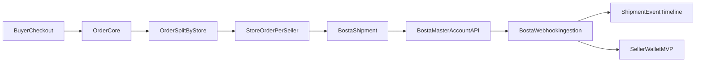

# Bosta Master-Account Integration Plan (Reviewed)

## Scope And Ground Truth
- **Primary spec**: [`skills/Bosta Server APIs.yaml`](../skills/Bosta%20Server%20APIs.yaml) (exported from Bosta API Reference).
- **Docs access reality**: the interactive API Reference page (`https://docs.bosta.co/api#/`) is not reliably accessible from the current environment; therefore this plan treats the YAML as authoritative and includes an explicit **spec-verification checkpoint** before production release.
- **Business constraint**: Manzili is **multi-vendor (multiple sellers)** but we operate **one Bosta business account** (Master Account approach).
- **Financial constraint**: Master account approach requires an in-app **seller wallet MVP** to handle shipping deductions and COD settlement.

## Why The Current Project Must “Adapt”
This repo currently has UI/flows that *look* like a marketplace, but key backend primitives are not implemented yet:
- **Checkout does not persist orders** (Stripe creates a Checkout Session; COD just redirects).
- **Orders pages use dummy data** (no real DB-backed order lifecycle).
- **Schema assumes single-store orders** (`Order.storeId`) which conflicts with “mixed cart” multi-seller checkout.
- **No shipment domain** (tracking number/AWB/status history).
- **No wallet domain** (pending/available balances, COD settlement).

Because Bosta requires structured delivery payloads (address zone/district + package specs), we must first implement a real, split-order backend and then layer Bosta shipping on top.

## Target Architecture (Master Account + Multi-Seller)

## Phase 0 — Spec Verification Checkpoint (Required Before Prod)
Even though the YAML is authoritative, we still do a quick verification step on staging before production:
- Validate auth scheme works as documented (Authorization header/API key).
- Validate create-delivery request fields and responses match YAML examples:
  - `/deliveries?apiVersion=1` (create)
  - `/deliveries/business/{trackingNumber}` (view)
- Validate address endpoints:
  - `/cities`, `/cities/{cityId}/zones`, `/cities/{cityId}/districts`
- Validate webhook payload shape for status updates (we’ll store raw payload regardless).

### Fast-track contract from `Bosta Server APIs.yaml`
Use this as the implementation contract to reduce trial-and-error:
- **Base URL in spec**: `http://app.bosta.co/api/v2/` (run with env-based override for staging/prod).
- **Auth reality**:
  - Deliveries and pickup-location endpoints commonly list `Bearer` and/or `ApiKey` security.
  - `ApiKey` is passed in `Authorization` header per spec security scheme.
  - Implement one auth injector that always sends `Authorization` and is configurable for token format.
- **Create delivery (`POST /deliveries?apiVersion=1`) minimum safe payload**:
  - required by schema: `type`, `cod`
  - practically required for successful marketplace shipment creation: `dropOffAddress`, `receiver`, `businessReference` or `uniqueBusinessReference`, and valid `specs`.
  - strongly recommended: `businessLocationId` (master account pickup mapping) and `webhookUrl`.
- **Address format expectation**:
  - address objects use `city` (name), `zoneId`, `districtId`, `firstLine`; `districtId` is the critical normalized key.
  - use `/cities` -> `/cities/{cityId}/districts` lookup flow to avoid free-text failures.
- **Returned tracking contract**:
  - create-delivery success payload includes `data.trackingNumber`.
  - use `GET /deliveries/business/{trackingNumber}` as primary read model for status/timeline/fees.
- **Operational controls from API**:
  - cancel before dispatch via `DELETE /deliveries/business/{trackingNumber}/terminate`.
  - generate labels via `POST /deliveries/mass-awb` (`requestedAwbType`: `A4|A6`, `lang`: `ar|en`).
- **Size/type normalization note**:
  - schema examples include `SMALL|MEDIUM|LARGE` and also `Normal|Light Bulky|Heavy Bulky` in query enums.
  - Keep internal enum + per-environment mapping table to avoid runtime rejects.

## Phase 1 — Data Model Refactor For Marketplace Orders
### 1) Fix order structure for mixed carts
Current problem: `Order.storeId` implies **one seller per order**.

Plan:
- Keep `Order` as the buyer checkout container (one per checkout).
- Add `StoreOrder` (one per seller per checkout).
- Associate items to `StoreOrder` via `OrderItem.storeOrderId`.
- Persist immutable pricing snapshots at checkout time so later updates don’t affect accounting.

### 2) Add shipment domain models
Add models to support carrier orchestration and tracking:
- `Shipment`:
  - links to `StoreOrder`
  - carrier = `BOSTA`
  - `bostaDeliveryId` (if provided), `trackingNumber`, `awbUrl` (if used)
  - `shippingCost`, `codAmount`, `status`, `createdAt/updatedAt`
- `ShipmentEvent`:
  - `shipmentId`, `eventType/status`, `occurredAt`, `rawPayload`
  - idempotency field (`externalEventId` or `payloadHash`)
- `StorePickupAddress`:
  - each seller’s pickup/origin address in Bosta-ready format (or mapping reference)

### 3) Add address mapping cache (Bosta zoning)
Bosta delivery payloads require normalized zoning identifiers:
- Create `BostaAddressMapping` cache keyed by (country, cityName, zoneName/districtName or ids).
- Store: `cityId`, `zoneId`, `districtId`, plus original text fields for audit.

## Phase 2 — Seller Wallet MVP (Master Account Economics)
We implement an MVP wallet to make “one carrier account, many sellers” financially correct.

### Wallet MVP requirements
- Per seller:
  - `pendingBalance`
  - `availableBalance`
- Record each posting as an immutable transaction:
  - `type` (SALE_CREDIT, SHIPPING_DEBIT, COD_PENDING_CREDIT, COD_RELEASE, ADJUSTMENT, PAYOUT_REQUEST, PAYOUT_PAID, etc.)
  - `amount`, `currency`
  - references to `Order`, `StoreOrder`, `Shipment`
  - idempotency key to prevent duplicate postings

### Posting rules (MVP)
- **Prepaid (Stripe)**:
  - At payment-confirmed time: store the seller gross for that `StoreOrder` as pending.
  - When shipment reaches a chosen “release” state (usually Delivered): move from pending → available.
  - Record `SHIPPING_DEBIT` (shipping cost attributed to that seller shipment). Recommended: deduct before release.
- **COD**:
  - Bosta collects cash and remits to the **master account**.
  - On “Delivered” event: credit seller as **pending** (not available yet).
  - When you manually confirm settlement (or after a configured delay): release pending → available.

### What this plan explicitly does NOT do (by choice)
- Full double-entry accounting and automated bank payouts (out of scope per wallet MVP).

## Phase 3 — Implement Real Order Lifecycle (Prerequisite For Shipping)
### Required backend behavior changes
- Replace dummy order behavior so both payment methods create DB-backed orders:
  - COD: create `Order` + `StoreOrder`s + items immediately; set status `ORDER_PLACED`.
  - Stripe: create `Order` + splits as `PENDING_PAYMENT`, then confirm payment server-side.

### Stripe confirmation (must be server-trusted)
Current flow checks session status client-side only.
Plan:
- Add server endpoint/webhook to confirm payment.
- Only after server confirmation:
  - mark `Order.isPaid = true`
  - transition `StoreOrder` states
  - start shipment creation workflow

## Phase 4 — Bosta Integration Layer
### Service modules (server-only)
- `lib/bosta/client`:
  - base URL (staging vs prod), `Authorization` header
  - retries/backoff, error normalization
- `lib/bosta/address`:
  - resolve Bosta city/zone/district via `/cities` + zones/district endpoints
  - caching in `BostaAddressMapping`
- `lib/bosta/deliveries`:
  - create: `POST /deliveries?apiVersion=1` using `BusinessadddeliveryRequest`
  - view/search/terminate where needed for ops
- `lib/bosta/pickupLocations`:
  - list existing: `GET /businesses/{id}/pickup-locations`
  - create missing locations: `POST /pickup-locations`
  - set default when required: `PUT /pickup-locations/{id}/default`

## Phase 5 — Address Adaptation (City/Zone/District)
### The adaptation you explicitly requested
Your current `Address` model stores free-text `city/state/zip`.
Bosta delivery payload expects zoning identifiers (`zoneId` + `districtId`) along with city name (see YAML create-delivery examples).

Plan:
- Add a checkout-time address step that yields valid `cityId/zoneId/districtId`:
  - Preferred: dropdowns populated from Bosta endpoints (cities → zones/districts).
  - Fallback: admin mapping when free-text cannot be resolved.
- Persist the resolved mapping on the address/shipment so future deliveries don’t need remapping.

## Phase 6 — Package Size Adaptation (Specs)
From YAML `BusinessadddeliveryRequest.specs`:
- `specs.size` examples include `SMALL|MEDIUM|LARGE` and size terms like `Normal|Light Bulky|Heavy Bulky` elsewhere in the spec; treat size as a controlled enum in our DB and map deterministically to what your Bosta account accepts.

Plan:
- Introduce minimal product shipping metadata:
  - weight (optional), dimensions (optional), and/or a seller-chosen default size category.
- Derive shipment-level `specs.size`:
  - deterministic threshold rules (configurable), store computed result on `Shipment` for audit.

## Phase 7 — Shipment Orchestration Per Seller
### When a shipment is created
- After COD order placement (or after Stripe payment confirmation):
  - split into `StoreOrder`s
  - for each `StoreOrder` create one Bosta delivery via master account
  - persist `trackingNumber` and returned identifiers

### Pickup location strategy (single master account)
- Because there is one Bosta account, standard practice is to register each seller pickup as a pickup location under the master account and store `businessLocationId` per seller (see YAML `businessLocationId`).
- Implementation sequence to reduce friction:
  1. At seller onboarding (or first shipment): ensure pickup location exists in Bosta.
  2. Store returned pickup location id on seller profile.
  3. Inject this id as `businessLocationId` in every create-delivery call.
  4. If missing/invalid id at runtime, fail fast with actionable seller-facing remediation.

## Phase 8 — Webhooks + Status Sync
- Implement webhook receiver:
  - store raw webhook payload
  - dedupe idempotently
  - update `Shipment.status`, then roll up to `StoreOrder` and buyer `Order`
- Use webhook events to trigger wallet transitions:
  - delivered → pending credits
  - settlement confirm (manual action/job) → available

## Phase 9 — UI/Operations Updates
- Buyer:
  - show per-seller shipments and tracking numbers under one checkout
- Seller dashboard:
  - show shipment status and AWB/tracking per store order
- Admin:
  - mapping override tooling for address zoning failures
  - manual COD settlement confirmation action

## Testing + Rollout Checklist
- Unit tests:
  - address resolver + caching
  - size mapping rules
  - wallet posting idempotency
- Integration tests (staging):
  - create delivery, view delivery, terminate delivery
  - webhook ingestion and deduplication
- Feature flags:
  - `BOSTA_INTEGRATION_ENABLED`, `WALLET_MVP_ENABLED`

## Appendix — Minimal Request/Response Contracts (from YAML)
### Create delivery request (minimum marketplace subset)
- endpoint: `POST /deliveries?apiVersion=1`
- body subset:
  - `type` (number, e.g. 10 send)
  - `cod` (number; can be 0 for prepaid, positive for COD)
  - `specs.size`, `specs.packageType`, optional `specs.packageDetails`
  - `dropOffAddress`: `city`, `zoneId`, `districtId`, `firstLine`, plus optional building/floor/apartment
  - `returnAddress` (recommended for return routing)
  - `receiver.firstName`, `receiver.phone` (required inside receiver object)
  - `businessReference` or `uniqueBusinessReference`
  - `businessLocationId` (recommended for multi-seller master-account routing)
  - `webhookUrl` (+ optional `webhookCustomHeaders.Authorization`)

### Create delivery success fields to persist
- `data._id` (Bosta delivery id)
- `data.trackingNumber` (primary external identifier)
- `data.state.code`, `data.state.value`
- `data.creationSrc`

### Business view response fields useful for sync
- endpoint: `GET /deliveries/business/{trackingNumber}`
- persist/consume:
  - current state: `state`, `maskedState`, `statesData`
  - financials: `cod`, `shipmentFees`
  - timeline/history arrays for event backfill
  - normalized address objects (pickup/dropOff/return)
